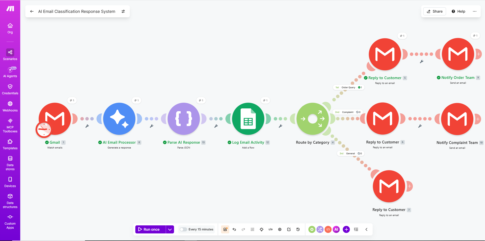
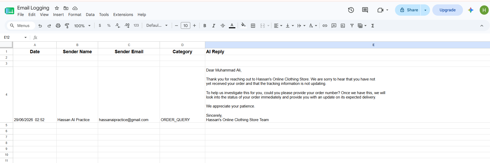

# ai-email-classification-response-system
AI-powered email classification and automated customer support workflow built with Make.com, Gemini AI, Gmail and Google Sheets.
# AI Email Classification & Response System

An AI-powered customer support automation workflow built using **Make.com**, **Google Gemini AI**, **Gmail**, and **Google Sheets**.

This project automatically reads incoming customer emails, understands the customer's request using AI, classifies the email into the correct category, generates a professional reply, sends the reply to the customer, notifies the relevant department when required, and stores the complete interaction in Google Sheets.

---

## Business Problem

Customer support teams receive many emails every day.

Some customers ask about their orders, some report complaints, while others send general questions.

Handling these emails manually is repetitive and time-consuming. A support agent has to:

- Read every email
- Understand the customer's issue
- Categorize the email
- Write a professional reply
- Send the email to the correct department when necessary
- Keep a record of every conversation

As the number of customer emails increases, this process becomes slower and requires more manpower.

---

## Solution

This workflow automates the first stage of customer support.

Whenever a customer sends an email, the workflow automatically:

- Reads the email from Gmail
- Uses Google Gemini AI to understand the customer's request
- Classifies the email as:
  - ORDER_QUERY
  - COMPLAINT
  - GENERAL
- Generates a professional reply in the customer's language
- Sends the reply to the customer
- Notifies the relevant department for Order Queries and Complaints
- Stores the complete interaction in Google Sheets

This helps reduce manual work and improves response time.

---

## Features

- Automatic email monitoring
- AI-powered email classification
- Professional AI-generated replies
- Supports English, Roman Urdu and Urdu
- Automatic customer replies
- Department notification for Order Queries
- Department notification for Complaints
- Automatic logging in Google Sheets
- Structured JSON response using Gemini AI
- Built completely with no-code automation

---

## Workflow

```text
Customer Email
        │
        ▼
Gmail (Watch Emails)
        │
        ▼
Google Gemini AI
(Analyze Email & Generate JSON)
        │
        ▼
Parse JSON
        │
        ▼
Save Email Details
(Google Sheets)
        │
        ▼
Router
│
├── ORDER_QUERY
│      ├── Reply to Customer
│      └── Notify Order Department
│
├── COMPLAINT
│      ├── Reply to Customer
│      └── Notify Complaint Department
│
└── GENERAL
       └── Reply to Customer
```

---

## Technologies Used

- Make.com
- Google Gemini AI
- Gmail
- Google Sheets
- JSON Parser

---

## Project Screenshots

### Workflow Overview



---

### Google Sheets Output


---

### Customer Reply Email



---

## What I Learned

While building this project, I learned how to:

- Build automation workflows using Make.com
- Integrate Google Gemini AI into a workflow
- Use JSON output and Parse JSON modules
- Route workflows based on AI classification
- Automate email replies
- Log AI-generated data into Google Sheets
- Design a practical business automation workflow

---

## Future Improvements

This is Version 1 of the project.

Future versions may include:

- CRM integration
- Order database lookup
- Automatic ticket creation
- Priority detection
- Sentiment analysis
- Slack or Microsoft Teams notifications
- Customer support dashboard

---

## Author

**Hassan Haider Abbas**

Electrical Engineer | AI Automation Learner

I enjoy building practical AI automation workflows that solve real business problems. Currently, I am learning Make.com, AI Automation, and Large Language Models (LLMs) by building hands-on projects.

---

Thank you for visiting this repository.
